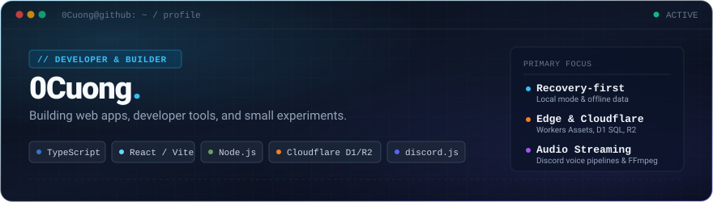

<div align="center">



<br/>

[](https://github.com/0Cuong)
[](https://github.com/0Cuong?tab=repositories&q=&type=&language=typescript)
[](https://github.com/0Cuong/audit2)
[](https://github.com/0Cuong/gecko)

<p align="center">
  <a href="#-about">About</a> &nbsp;•&nbsp;
  <a href="#-current-focus">Current Focus</a> &nbsp;•&nbsp;
  <a href="#-selected-projects">Selected Projects</a> &nbsp;•&nbsp;
  <a href="#-technical-stack">Technical Stack</a> &nbsp;•&nbsp;
  <a href="#-repositories">Directory</a>
</p>

</div>

---

### ✦ Universe Experience Architecture

This repository contains the prebuilt static client for the interactive **universe for my gf** experience. The production site is deployed directly to GitHub Pages; the Express server exists only as a local development server and is not part of the Pages deployment.

```text
Browser
  └─ GitHub Pages
      ├─ index.html
      ├─ assets/        hashed JS/CSS + visual assets
      ├─ portrait/      personal portrait media
      ├─ music/         local audio
      └─ *.json         runtime content/metadata

Local development
  └─ Node.js + Express
      └─ http://127.0.0.1:3000
```

The repository intentionally tracks the generated frontend artifact because the original source tree is not present. The build/check command therefore validates the static artifact rather than pretending to regenerate the application.

#### Local development

Requires Node.js 20 or newer:

    npm install
    npm run build
    npm run dev

GitHub Pages uses one deterministic workflow: `.github/workflows/static.yml`. It stages only the files required by the website before deployment.

---
### ✦ About

I build web applications, developer tools, and software experiments across the TypeScript and Node.js ecosystems. My work focuses on **recovery-first application design**, **serverless edge architectures** (Cloudflare Workers, D1, R2), and **real-time audio streaming tooling** in Discord.

I prioritize small, well-scoped builds that solve specific problems, run reliably without fragile dependencies, and maintain local-first data independence.

---

### ✦ Current Focus

```text
┌─ SYSTEM STATUS ──────────────────────────────────────────────────────────────┐
│                                                                              │
│  ▸ REFINING    audit2 (CUONGISME) — Recovery-first memory & relationship app │
│                Local recovery server + Cloudflare D1/R2 production sync      │
│                                                                              │
│  ▸ MAINTAINING gecko — High-performance Discord voice streaming bot          │
│                Low-latency queues, prism-media & FFmpeg audio pipeline       │
│                                                                              │
│  ▸ EXPLORING   Edge compute (Cloudflare Workers), portable agent skills,     │
│                and lightweight reactive web experiences                      │
│                                                                              │
└──────────────────────────────────────────────────────────────────────────────┘
```

---

### ✦ Selected Projects

#### 01 / FEATURED BUILD — [audit2](https://github.com/0Cuong/audit2) `CUONGISME`

> **A Vite + React + TypeScript relationship and memory web app with a recovery-first local mode and a Cloudflare D1/R2 production path.**

```text
┌─────────────────────────────────────────────────────────────────────────────┐
│  STACK: TypeScript · React · Vite · Cloudflare Workers · D1 SQL · R2 Media   │
│  SOURCE: https://github.com/0Cuong/audit2                                    │
└─────────────────────────────────────────────────────────────────────────────┘
```

* **Recovery-First Local Mode**: Features an isolated local recovery server (`npm run dev`) allowing recovered application data and media files to be inspected and reconciled together before production synchronization.
* **Cloudflare Edge Deployment**: Production path served as Cloudflare Worker Assets, persisting structured relational records in Cloudflare D1 (SQL) and binary assets in Cloudflare R2 object storage.
* **Agent Workflow & Skills Architecture**: Ships with an internal `skills/` catalog and `AGENTS.md` standard for automated progressive routing, auditing, and accessibility validation (`npm run skills:route`).

[**Explore audit2 Repository →**](https://github.com/0Cuong/audit2)

<br/>

#### 02 / AUDIO TOOLING — [gecko](https://github.com/0Cuong/gecko)

> **A powerful Discord music bot built for Vietnamese communities, streaming audio into voice channels with queue controls and multi-source playback.**

```text
┌─────────────────────────────────────────────────────────────────────────────┐
│  STACK: TypeScript · Node.js (>=20) · discord.js · @discordjs/voice · SWC   │
│  SOURCE: https://github.com/0Cuong/gecko                                     │
│  SITE:   https://0cuong.github.io/gecko/                                     │
└─────────────────────────────────────────────────────────────────────────────┘
```

* **Voice Channel Streaming**: Native Discord voice integration leveraging `@discordjs/voice`, `prism-media`, and `ffmpeg-static` for low-jitter audio transcoding and playback.
* **Source Extraction & Queue Controls**: Flexible extraction engine supporting YouTube and streaming providers with interactive queue management and playback control.
* **Modern Build Pipeline**: Compiled via `@swc/core` and strict TypeScript for rapid execution in modern Node.js environments.

[**Explore gecko Repository →**](https://github.com/0Cuong/gecko) &nbsp;•&nbsp; [**View Documentation →**](https://0cuong.github.io/gecko/)

<br/>

#### 03 / WEB EXPERIMENTS — [countday-love](https://github.com/0Cuong/countday-love) & [shh](https://github.com/0Cuong/shh)

* **[countday-love](https://github.com/0Cuong/countday-love)**: Lightweight, static relationship day-counter website with responsive styling and real-time counter logic. Built with vanilla HTML, CSS, and JavaScript.  
  [Repository](https://github.com/0Cuong/countday-love) &nbsp;•&nbsp; [Live Experience](https://0cuong.github.io/countday-love/)

* **[shh](https://github.com/0Cuong/shh)**: Minimalist interactive web canvas and atmospheric visual experiment.  
  [Repository](https://github.com/0Cuong/shh) &nbsp;•&nbsp; [Live Experience](https://0cuong.github.io/shh/)

---

### ✦ Technical Stack

A curated view of tools and runtimes used across active projects:

| Domain | Technologies | Practical Role in Projects |
| :--- | :--- | :--- |
| **Languages** | `TypeScript`<br/>`JavaScript` (ESNext)<br/>`SQL` | Strict typing across client apps, bots, and edge database schemas. |
| **Frontend** | `React`<br/>`Vite`<br/>`HTML5` / `CSS3` | Fast single-page applications, component architectures, and responsive interfaces. |
| **Backend & Runtimes** | `Node.js` (>=20)<br/>`Express` | Voice streaming bots, local recovery servers, and development tooling. |
| **Cloud & Storage** | `Cloudflare Workers`<br/>`Cloudflare D1`<br/>`Cloudflare R2` | Edge computing, serverless SQL persistence, and S3-compatible media object storage. |
| **Bot & Audio Tooling** | `discord.js`<br/>`@discordjs/voice`<br/>`FFmpeg` / `prism-media` | Discord API gateways, opus audio transcoding, and voice stream buffers. |
| **Build & Tooling** | `@swc/core`<br/>`pnpm` / `npm`<br/>`GitHub Pages` | High-speed compilation, deterministic dependency trees, and static hosting. |

---

### ✦ Engineering Principles

* **Local-First & Data Resilience**: Applications should work predictably in local environments. Data models are designed with fallback and recovery mechanisms rather than rigid vendor lock-in.
* **Edge Where It Counts**: Using Cloudflare's edge primitives (Workers, D1, R2) to minimize server management while delivering sub-millisecond global responses.
* **Stream-Native Audio**: Managing voice and media through continuous stream pipelines rather than heavy memory buffering.
* **Keep Experiments Lean**: Build small, verify with working code, and iterate through hands-on implementation.

---

### ✦ Repositories

| Repository | Focus | Primary Tech | Links |
| :--- | :--- | :--- | :--- |
| **[audit2](https://github.com/0Cuong/audit2)** | Recovery-first memory & relationship app | `TypeScript`, `React`, `Vite`, `Cloudflare D1/R2` | [Repo](https://github.com/0Cuong/audit2) |
| **[gecko](https://github.com/0Cuong/gecko)** | High-performance Discord voice music bot | `TypeScript`, `Node.js`, `discord.js`, `FFmpeg` | [Repo](https://github.com/0Cuong/gecko) · [Docs](https://0cuong.github.io/gecko/) |
| **[countday-love](https://github.com/0Cuong/countday-love)** | Static relationship countdown experience | `HTML`, `CSS`, `JavaScript` | [Repo](https://github.com/0Cuong/countday-love) · [Live](https://0cuong.github.io/countday-love/) |
| **[shh](https://github.com/0Cuong/shh)** | Minimalist interactive web canvas | `JavaScript`, `CSS` | [Repo](https://github.com/0Cuong/shh) · [Live](https://0cuong.github.io/shh/) |
| **[0Cuong](https://github.com/0Cuong/0Cuong)** | GitHub profile config & starry universe build | `Markdown`, `SVG`, `React`, `Vite` | [Repo](https://github.com/0Cuong/0Cuong) |

---

<div align="center">

```text
0Cuong · Building web apps, developer tools, and small experiments.
```

<a href="#-about">▲ Back to top</a>

</div>
